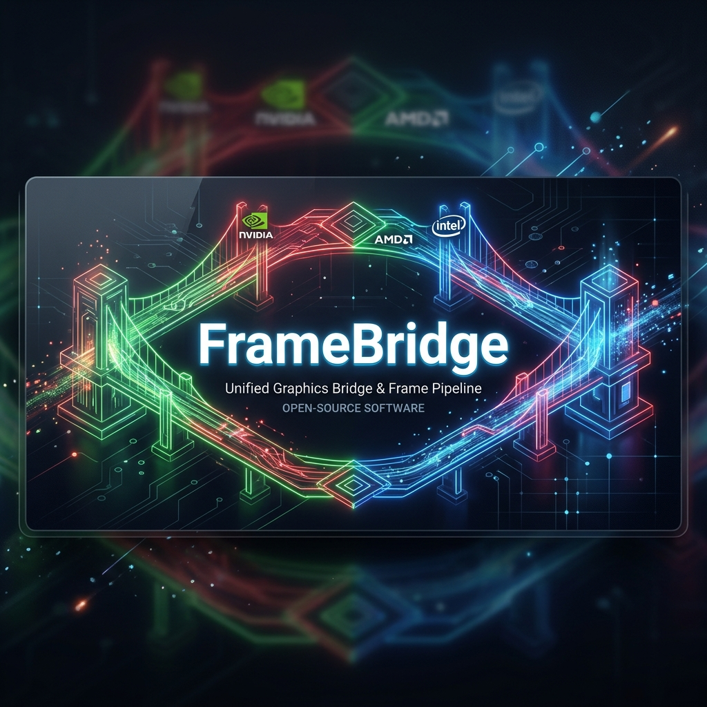

# FrameBridge

[](https://github.com/dreyvinixz/FrameBridge/actions/workflows/build.yml)

**FrameBridge** bridges upscaling and frame generation technologies across all GPUs. Built from source — compiled, packaged, and released automatically.

## ❤️ Acknowledgments and OptiScaler Heritage

This project is deeply indebted to [OptiScaler](https://github.com/optiscaler/OptiScaler), the incredible open-source project that serves as our core engine. OptiScaler's developers have done monumental work in bringing cross-vendor upscaling and frame generation to the community. 

**FrameBridge is a community-driven fork of OptiScaler.** We have no intention of selling anything or taking credit for their core engine. Our goal is simply to build upon their amazing foundation, integrating the "all-in-one installer" philosophy inspired by [DLSS-Enabler](https://github.com/artur-graniszewski/DLSS-Enabler) directly with the source code. We hope that FrameBridge contributes back to the community by making these technologies more accessible and easier to deploy.



## 🚀 What is FrameBridge?

FrameBridge is a fork of OptiScaler that takes the "all-in-one installer" philosophy from DLSS-Enabler and combines it with the full source code of OptiScaler. The result: a project you can **build from source**, **customize**, and **contribute to** — with automated CI/CD that compiles the C++ code and generates a ready-to-use installer.

### Key Features

- ✅ **Built from source** — Full C++ source code, compiled via CI/CD
- ✅ **All-in-one installer** — Inno Setup installer with all components pre-configured
- ✅ **Automated releases** — GitHub Actions pipeline: source → compile → package → release
- ✅ **Multi-GPU support** — NVIDIA, AMD, and Intel GPUs supported
- ✅ **Frame Generation** — FSR-FG, XeFG, DLSSG-to-FSR3 (via Nukem9's mod)
- ✅ **Upscaling** — XeSS, FSR 2.x/3.x/4.x, DLSS replacement

### Bundled Components

| Component | Version | Source |
|-----------|---------|--------|
| OptiScaler | 0.9.3 | Compiled from source |
| Fakenvapi | 1.4.1 | Bundled with OptiScaler |
| DLSSG-to-FSR3 | 0.130 | Nukem9's mod |
| FFX SDK | 2.2 | FSR 4.1 + FSR-FG 4.0.0 |
| XeSS SDK | 3.0.1 | Intel |

## 📦 Download

Download the latest installer from the [Releases](../../releases) page.

## 🛠️ Building from Source

### Prerequisites

- **Visual Studio 2022** with C++ Desktop workload
- **Windows SDK 10.0+**
- **Git** with submodule support
- **Inno Setup 6.2.0** (for installer generation)
- **7-Zip** (for packaging)

### Build Steps

```powershell
# Clone with submodules
git clone --recurse-submodules https://github.com/dreyvinixz/FrameBridge.git
cd FrameBridge

# Build OptiScaler DLL
msbuild OptiScaler.sln /p:Configuration=Release /p:Platform=x64

# Generate installer
.\tools\build-installer.ps1
```

### CI/CD Pipeline

The automated pipeline handles everything:

1. **Compile** OptiScaler from C++ source
2. **Download** latest external dependencies (XeSS, FidelityFX, etc.)
3. **Package** all components with Inno Setup
4. **Release** as a GitHub release with installer

## 🎮 Installation

1. Download the installer from [Releases](../../releases)
2. Run the setup and select your game directory
3. Choose installation type:
   - **Preferred (DLL package)** — Recommended for most users
   - **Experimental support** — For AMD and Intel GPUs

## 🤝 Contributing

Contributions are welcome! Please read [CONTRIBUTING.md](CONTRIBUTING.md) before submitting PRs.

### Code Guidelines

- Every `.cpp` file must include `"pch.h"` as the **first** non-comment line
- Never include `"pch.h"` inside header files
- Follow the `.clang-format` style

## 📜 License

This project is licensed under the **GNU General Public License v3.0** — see [LICENSE](LICENSE) for details.

### Acknowledgments

- [OptiScaler](https://github.com/optiscaler/OptiScaler) — Core upscaling/frame generation engine (GPLv3)
- [DLSS-Enabler](https://github.com/artur-graniszewski/DLSS-Enabler) — Installer concept and packaging (MIT)
- [Nukem9's DLSSG-to-FSR3](https://github.com/Nukem9/dlssg-to-fsr3) — Frame generation module
- [Intel XeSS](https://github.com/intel/xess) — XeSS SDK
- [AMD FidelityFX](https://github.com/GPUOpen-LibrariesAndSDKs/FidelityFX-SDK) — FSR SDK
