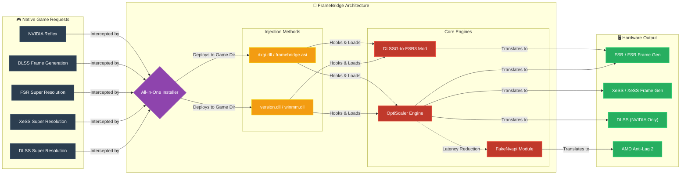

# 🏛️ FrameBridge Architecture

The diagram below illustrates how FrameBridge integrates the core OptiScaler engine and Nukem9's mod via an **all-in-one installer** to bridge the gap between native game requests and your hardware capabilities.

### How it works
1. **Input:** The game natively attempts to load upscaling/frame generation technologies (like DLSS).
2. **Installer:** Instead of manually moving files, the FrameBridge Installer drops the required interception DLLs (like `version.dll`) directly into your game directory.
3. **Core Engines:** The injection DLL loads the powerful **OptiScaler** and **DLSSG-to-FSR3** engines in the background.
4. **Output:** These engines translate the proprietary game requests into open standards (like FSR or XeSS) that run smoothly on your specific AMD, Intel, or NVIDIA graphics card.
